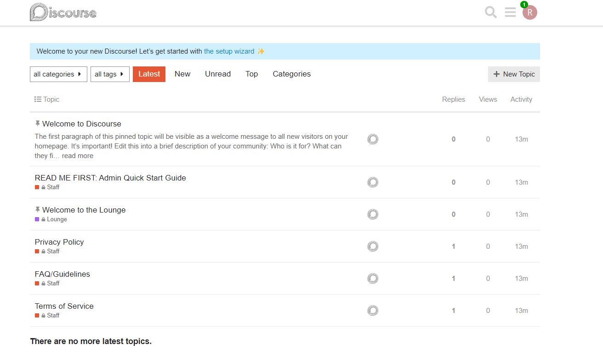

# Discourse CI/CD pipeline

Deploy Discourse server with CI/CD on Elestio

 
 

# Once deployed ...

### Note:- It will take 3 to 5 minutes to start up after deployment..

You can can open Discourse UI here:

    URL: https://[CI_CD_DOMAIN]
    login: root
    password: [ADMIN_PASSWORD]
